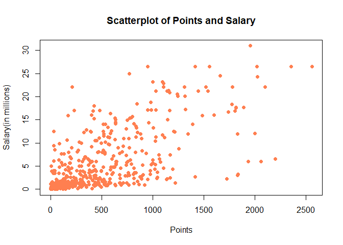
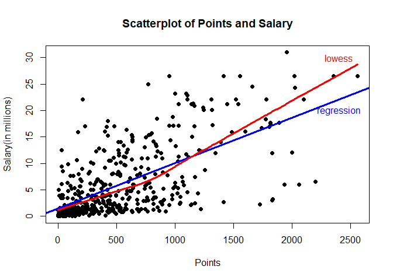
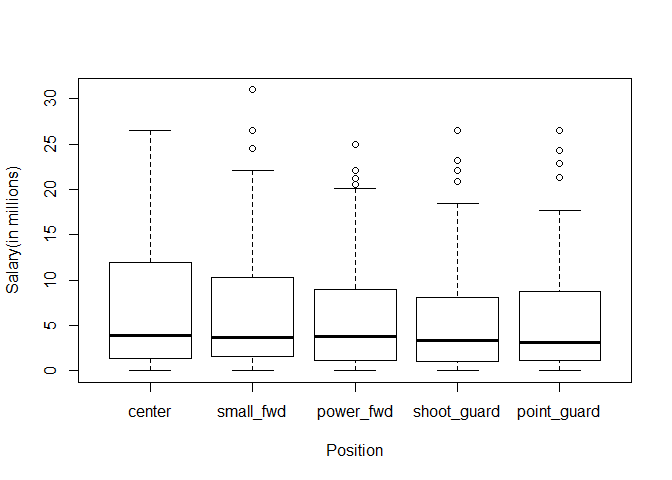

hw
================

load data file
==============

``` r
load("./nba2017-salary-points.RData")
ls()
```

    ## [1] "player"   "points"   "points1"  "points2"  "points3"  "position"
    ## [7] "salary"   "team"

A bit of data preprocessing
---------------------------

``` r
salary_million<-round(salary/1000000,2)
position <- factor(position, levels=c('C','SF','PF','SG','PG'), labels=c( 'center','small_fwd','power_fwd','shoot_guard','point_guard'))
table(position)
```

    ## position
    ##      center   small_fwd   power_fwd shoot_guard point_guard 
    ##          89          83          89          95          85

Scatterplot of Points and Salary
--------------------------------

``` r
plot(points,salary_million,xlab = 'Points',ylab = 'Salary(in millions)',main = "Scatterplot of Points and Salary",cex=1,pch=19,col='coral')
```



Correlation between Points and Salary
-------------------------------------

``` r
n<-length(points)
cat(sep="", "n=",n,"\n")
```

    ## n=441

``` r
mean_points<-sum(points)/n
cat(sep="", "mean_points=",mean_points,"\n")
```

    ## mean_points=546.6054

``` r
mean_salary<-sum(salary_million)/n
cat(sep="", "mean_salary=",mean_salary,"\n")
```

    ## mean_salary=6.186689

``` r
var_points<-sum((points-mean_points)^2)/(n-1)
cat(sep="", "var_points=",var_points,"\n")
```

    ## var_points=239136.2

``` r
var_salary<-sum((salary_million-mean_salary)^2)/(n-1)
cat(sep="", "var_salary=",var_salary,"\n")
```

    ## var_salary=43.19524

``` r
sd_points<-sqrt(var_points)
cat(sep="", "sd_points=",sd_points,"\n")
```

    ## sd_points=489.0156

``` r
sd_salary<-sqrt(var_salary)
cat(sep="", "sd_salary=",sd_salary,"\n")
```

    ## sd_salary=6.572309

``` r
cov_xy<-sum((points-mean_points)*(salary_million-mean_salary))/(n-1)
cat(sep="", "cov_xy=",cov_xy,"\n")
```

    ## cov_xy=2046.424

``` r
cor_xy<-cov_xy/(sd_points*sd_salary)
cat(sep="", "cor_xy=",cor_xy,"\n")
```

    ## cor_xy=0.6367296

Simple Linear Regression
------------------------

``` r
b1<-cor_xy*sd_salary/sd_points
b1
```

    ## [1] 0.008557567

``` r
b0<-mean_salary-b1*mean_points
b0
```

    ## [1] 1.509077

``` r
predict_salary<-b1*points+b0
```

### Summary statistics of Y

``` r
summary(predict_salary)
```

    ##    Min. 1st Qu.  Median    Mean 3rd Qu.    Max. 
    ##   1.509   2.844   5.206   6.187   8.184  23.399

### the regression equation

*Y* = 1.509077 + 0.008557567 \* *x*

The slope is positive, the score is positively correlated with the salary,which means that the high score is in exchange for high salary.

when the points equal zero,the intercept which represents salary equals 1.509077.This shows that the basic salary of the NBA player is about $1.509077 million

### the predicted salary for a player that scores

``` r
cat(sep=" ", " 0   points"," salary=",1.509077 + 0.008557567*0,"\n")
```

    ##  0   points  salary= 1.509077

``` r
cat(sep=" ", " 100 points"," salary=",1.509077 + 0.008557567*100,"\n")
```

    ##  100 points  salary= 2.364834

``` r
cat(sep=" ", " 500 points"," salary=",1.509077 + 0.008557567*500,"\n")
```

    ##  500 points  salary= 5.787861

``` r
cat(sep=" ", "1000 points"," salary=",1.509077 + 0.008557567*1000,"\n")
```

    ## 1000 points  salary= 10.06664

``` r
cat(sep=" ", "2000 points"," salary=",1.509077 + 0.008557567*2000,"\n")
```

    ## 2000 points  salary= 18.62421

Plotting the regression line
----------------------------

``` r
plot(points,salary_million,xlab = 'Points',ylab = 'Salary(in millions)',main = "Scatterplot of Points and Salary",cex=1,pch=19)
abline(a=b0,b=b1,col='blue',lwd=3)
lines(lowess(points,salary_million), col ='red',lwd=3)
text(2400, 30,'lowess',col = 'red')
text(2400, 20,'regression',col = 'blue')
```

 \#\#Regression residuals and Coefficient of Determination R^2

``` r
residuals<-salary_million-predict_salary
summary(residuals)
```

    ##    Min. 1st Qu.  Median    Mean 3rd Qu.    Max. 
    ## -14.187  -2.792  -1.095   0.000   2.556  18.814

``` r
RSS<-sum(residuals^2)
cat(sep="", "RSS=",RSS,"\n")
```

    ## RSS=11300.45

``` r
TSS<-sum((salary_million-mean(salary_million))^2)
cat(sep="", "TSS=",TSS,"\n")
```

    ## TSS=19005.91

``` r
R2<-1-RSS/TSS
cat(sep="", "R2=",R2,"\n")
```

    ## R2=0.4054246

Exploring Position and Experience
---------------------------------

``` r
plotdata<-data.frame(salary_million,position)
boxplot(salary_million~position,data=plotdata,xlab = 'Position',ylab ='Salary(in millions)')
```



Position does not seem to be related with Salary
