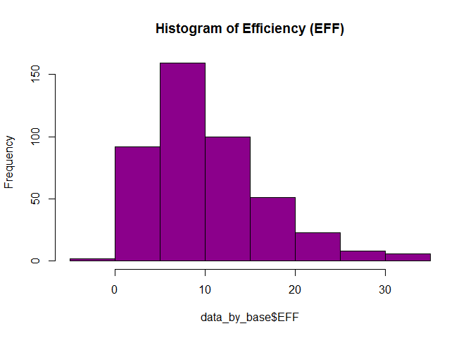
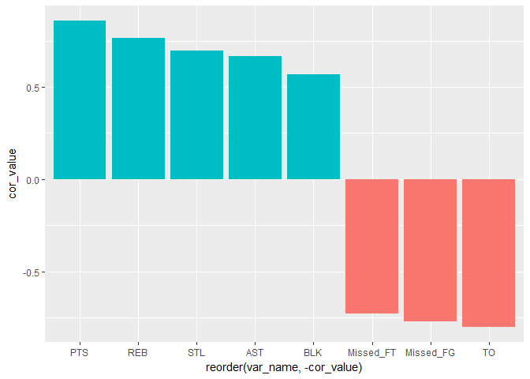
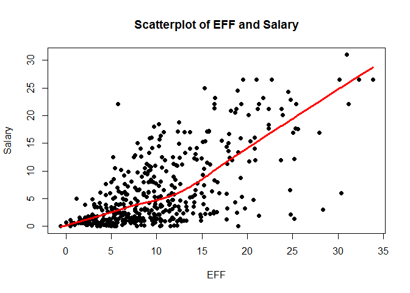
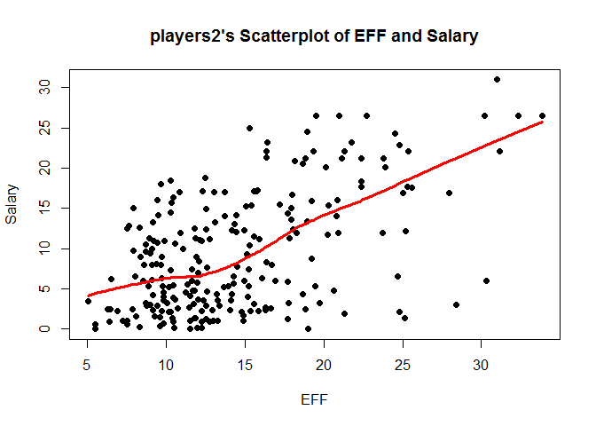

hw
================

Download the data
=================

``` r
github <- "https://github.com/ucb-stat133/stat133-fall-2017/raw/master/"
file <- "data/nba2017-player-statistics.csv"
csv <- paste0(github, file)
download.file(url = csv, destfile = 'nba2017-player-statistics.csv')
```

Import the data in R
====================

``` r
library("readr")
library("ggplot2")
library("lattice")

data_by_base<-read.csv("./data/nba2017-player-statistics.csv",header = TRUE)
str(data_by_base)
```

    ## 'data.frame':    441 obs. of  24 variables:
    ##  $ Player      : Factor w/ 441 levels "A.J. Hammons",..: 6 16 30 103 146 161 169 181 189 213 ...
    ##  $ Team        : Factor w/ 30 levels "ATL","BOS","BRK",..: 2 2 2 2 2 2 2 2 2 2 ...
    ##  $ Position    : Factor w/ 5 levels "C","PF","PG",..: 1 2 5 3 4 3 4 5 4 2 ...
    ##  $ Experience  : Factor w/ 19 levels "1","10","11",..: 18 3 15 19 18 14 13 11 19 15 ...
    ##  $ Salary      : num  26540100 12000000 8269663 1450000 1410598 ...
    ##  $ Rank        : int  4 6 5 15 11 1 3 13 8 10 ...
    ##  $ Age         : int  30 29 26 22 31 27 26 21 20 29 ...
    ##  $ GP          : int  68 80 55 5 47 76 72 29 78 78 ...
    ##  $ GS          : int  68 77 55 0 0 76 72 0 20 6 ...
    ##  $ MIN         : int  2193 1608 1835 17 538 2569 2335 220 1341 1232 ...
    ##  $ FGM         : int  379 213 359 3 95 682 333 25 192 114 ...
    ##  $ FGA         : int  801 370 775 4 232 1473 720 58 423 262 ...
    ##  $ Points3     : int  86 27 108 1 39 245 157 12 46 45 ...
    ##  $ Points3_atts: int  242 66 277 1 111 646 394 35 135 130 ...
    ##  $ Points2     : int  293 186 251 2 56 437 176 13 146 69 ...
    ##  $ Points2_atts: int  559 304 498 3 121 827 326 23 288 132 ...
    ##  $ FTM         : int  108 67 68 3 33 590 176 6 85 26 ...
    ##  $ FTA         : int  135 100 93 6 41 649 217 9 124 37 ...
    ##  $ OREB        : int  95 117 65 2 17 43 48 6 45 60 ...
    ##  $ DREB        : int  369 248 269 2 68 162 367 20 175 213 ...
    ##  $ AST         : int  337 140 121 3 33 449 155 4 64 71 ...
    ##  $ STL         : int  52 52 68 0 9 70 72 10 35 26 ...
    ##  $ BLK         : int  87 62 11 0 7 13 23 2 18 17 ...
    ##  $ TO          : int  116 77 88 0 25 210 79 4 68 39 ...

``` r
data_by_readr<-read_csv("./data/nba2017-player-statistics.csv")
```

    ## Parsed with column specification:
    ## cols(
    ##   .default = col_integer(),
    ##   Player = col_character(),
    ##   Team = col_character(),
    ##   Position = col_character(),
    ##   Experience = col_character(),
    ##   Salary = col_double()
    ## )

    ## See spec(...) for full column specifications.

``` r
str(data_by_readr)
```

    ## Classes 'tbl_df', 'tbl' and 'data.frame':    441 obs. of  24 variables:
    ##  $ Player      : chr  "Al Horford" "Amir Johnson" "Avery Bradley" "Demetrius Jackson" ...
    ##  $ Team        : chr  "BOS" "BOS" "BOS" "BOS" ...
    ##  $ Position    : chr  "C" "PF" "SG" "PG" ...
    ##  $ Experience  : chr  "9" "11" "6" "R" ...
    ##  $ Salary      : num  26540100 12000000 8269663 1450000 1410598 ...
    ##  $ Rank        : int  4 6 5 15 11 1 3 13 8 10 ...
    ##  $ Age         : int  30 29 26 22 31 27 26 21 20 29 ...
    ##  $ GP          : int  68 80 55 5 47 76 72 29 78 78 ...
    ##  $ GS          : int  68 77 55 0 0 76 72 0 20 6 ...
    ##  $ MIN         : int  2193 1608 1835 17 538 2569 2335 220 1341 1232 ...
    ##  $ FGM         : int  379 213 359 3 95 682 333 25 192 114 ...
    ##  $ FGA         : int  801 370 775 4 232 1473 720 58 423 262 ...
    ##  $ Points3     : int  86 27 108 1 39 245 157 12 46 45 ...
    ##  $ Points3_atts: int  242 66 277 1 111 646 394 35 135 130 ...
    ##  $ Points2     : int  293 186 251 2 56 437 176 13 146 69 ...
    ##  $ Points2_atts: int  559 304 498 3 121 827 326 23 288 132 ...
    ##  $ FTM         : int  108 67 68 3 33 590 176 6 85 26 ...
    ##  $ FTA         : int  135 100 93 6 41 649 217 9 124 37 ...
    ##  $ OREB        : int  95 117 65 2 17 43 48 6 45 60 ...
    ##  $ DREB        : int  369 248 269 2 68 162 367 20 175 213 ...
    ##  $ AST         : int  337 140 121 3 33 449 155 4 64 71 ...
    ##  $ STL         : int  52 52 68 0 9 70 72 10 35 26 ...
    ##  $ BLK         : int  87 62 11 0 7 13 23 2 18 17 ...
    ##  $ TO          : int  116 77 88 0 25 210 79 4 68 39 ...
    ##  - attr(*, "spec")=List of 2
    ##   ..$ cols   :List of 24
    ##   .. ..$ Player      : list()
    ##   .. .. ..- attr(*, "class")= chr  "collector_character" "collector"
    ##   .. ..$ Team        : list()
    ##   .. .. ..- attr(*, "class")= chr  "collector_character" "collector"
    ##   .. ..$ Position    : list()
    ##   .. .. ..- attr(*, "class")= chr  "collector_character" "collector"
    ##   .. ..$ Experience  : list()
    ##   .. .. ..- attr(*, "class")= chr  "collector_character" "collector"
    ##   .. ..$ Salary      : list()
    ##   .. .. ..- attr(*, "class")= chr  "collector_double" "collector"
    ##   .. ..$ Rank        : list()
    ##   .. .. ..- attr(*, "class")= chr  "collector_integer" "collector"
    ##   .. ..$ Age         : list()
    ##   .. .. ..- attr(*, "class")= chr  "collector_integer" "collector"
    ##   .. ..$ GP          : list()
    ##   .. .. ..- attr(*, "class")= chr  "collector_integer" "collector"
    ##   .. ..$ GS          : list()
    ##   .. .. ..- attr(*, "class")= chr  "collector_integer" "collector"
    ##   .. ..$ MIN         : list()
    ##   .. .. ..- attr(*, "class")= chr  "collector_integer" "collector"
    ##   .. ..$ FGM         : list()
    ##   .. .. ..- attr(*, "class")= chr  "collector_integer" "collector"
    ##   .. ..$ FGA         : list()
    ##   .. .. ..- attr(*, "class")= chr  "collector_integer" "collector"
    ##   .. ..$ Points3     : list()
    ##   .. .. ..- attr(*, "class")= chr  "collector_integer" "collector"
    ##   .. ..$ Points3_atts: list()
    ##   .. .. ..- attr(*, "class")= chr  "collector_integer" "collector"
    ##   .. ..$ Points2     : list()
    ##   .. .. ..- attr(*, "class")= chr  "collector_integer" "collector"
    ##   .. ..$ Points2_atts: list()
    ##   .. .. ..- attr(*, "class")= chr  "collector_integer" "collector"
    ##   .. ..$ FTM         : list()
    ##   .. .. ..- attr(*, "class")= chr  "collector_integer" "collector"
    ##   .. ..$ FTA         : list()
    ##   .. .. ..- attr(*, "class")= chr  "collector_integer" "collector"
    ##   .. ..$ OREB        : list()
    ##   .. .. ..- attr(*, "class")= chr  "collector_integer" "collector"
    ##   .. ..$ DREB        : list()
    ##   .. .. ..- attr(*, "class")= chr  "collector_integer" "collector"
    ##   .. ..$ AST         : list()
    ##   .. .. ..- attr(*, "class")= chr  "collector_integer" "collector"
    ##   .. ..$ STL         : list()
    ##   .. .. ..- attr(*, "class")= chr  "collector_integer" "collector"
    ##   .. ..$ BLK         : list()
    ##   .. .. ..- attr(*, "class")= chr  "collector_integer" "collector"
    ##   .. ..$ TO          : list()
    ##   .. .. ..- attr(*, "class")= chr  "collector_integer" "collector"
    ##   ..$ default: list()
    ##   .. ..- attr(*, "class")= chr  "collector_guess" "collector"
    ##   ..- attr(*, "class")= chr "col_spec"

Right after importing the data
------------------------------

``` r
i<-1
data_by_base$Experience<-as.character(data_by_base$Experience)
while(i<(length(data_by_base$Experience)+1)){
    if(data_by_base$Experience[i]=='R'){
      data_by_base$Experience[i]='0'
    }
    i<-i+1
}
data_by_base$Experience<-as.integer(data_by_base$Experience)
cat(sep="", "the type of Experience is:",typeof(data_by_base$Experience),"\n")
```

    ## the type of Experience is:integer

Performance of players
----------------------

``` r
data_by_base$Missed_FG<-data_by_base$FGA-data_by_base$FGM
data_by_base$Missed_FT<-data_by_base$FTA-data_by_base$FTM
data_by_base$PTS<-data_by_base$FTM+2*data_by_base$Points2+3*data_by_base$Points3
data_by_base$REB<-data_by_base$OREB+data_by_base$DREB
data_by_base$MPG<-data_by_base$MIN/data_by_base$GP

data_by_base$EFF<- (data_by_base$PTS + data_by_base$REB + data_by_base$AST + 
                    data_by_base$STL + data_by_base$BLK - data_by_base$Missed_FG -                         data_by_base$Missed_FT - data_by_base$TO)/data_by_base$GP

summary(data_by_base$EFF)
```

    ##    Min. 1st Qu.  Median    Mean 3rd Qu.    Max. 
    ##  -0.600   5.452   9.090  10.137  13.247  33.840

``` r
hist(data_by_base$EFF,main=('Histogram of Efficiency (EFF)'),col="darkmagenta")
```



``` r
high_EFF<-subset(data_by_base,select = c('Player','Team','Salary','EFF'))
high_EFF<-high_EFF[order(high_EFF$EFF,decreasing = TRUE),]
top_ten<-high_EFF[1:10,]
top_ten
```

    ##                    Player Team   Salary      EFF
    ## 305     Russell Westbrook  OKC 26540100 33.83951
    ## 256          James Harden  HOU 26540100 32.34568
    ## 355         Anthony Davis  NOP 22116750 31.16000
    ## 28           LeBron James  CLE 30963450 30.97297
    ## 404    Karl-Anthony Towns  MIN  5960160 30.32927
    ## 228          Kevin Durant  GSW 26540100 30.19355
    ## 74  Giannis Antetokounmpo  MIL  2995421 28.37500
    ## 359      DeMarcus Cousins  NOP 16957900 27.94118
    ## 110          Jimmy Butler  CHI 17552209 25.60526
    ## 119      Hassan Whiteside  MIA 22116750 25.36364

``` r
negative_EFF<-subset(data_by_base,data_by_base$EFF<0)
as.character(negative_EFF$Player)
```

    ## [1] "Patricio Garino"

``` r
j<-1
cor_value<-c()
var_name<-c('PTS','REB','AST','STL','BLK','Missed_FG','Missed_FT','TO')
while(j<(length(var_name)+1)){
  if(j>5){
    temp<-(-cor(data_by_base$EFF,data_by_base[var_name[j]]))
  }
  else{
    temp<-(cor(data_by_base$EFF,data_by_base[var_name[j]]))
  }
  cor_value<-c(cor_value,temp)
  j<-j+1
}

cor_result<-data.frame(var_name=var_name,cor_value=cor_value) 


cor_result<-cor_result[order(cor_result$cor_value,decreasing = TRUE),]
cor_result$var_name<-factor(cor_result$var_name)
cor_result
```

    ##    var_name  cor_value
    ## 1       PTS  0.8588644
    ## 2       REB  0.7634501
    ## 4       STL  0.6957286
    ## 3       AST  0.6689232
    ## 5       BLK  0.5679571
    ## 7 Missed_FT -0.7271456
    ## 6 Missed_FG -0.7722477
    ## 8        TO -0.8003289

``` r
cor_result$label<-(cor_value>0)
ggplot(cor_result,aes(x=reorder(var_name,-cor_value),cor_value,fill=label))+
    geom_bar(stat="identity")+theme(legend.position="none")
```



Efficiency and Salary
---------------------

``` r
data_by_base$Salary<-data_by_base$Salary/1000000
plot(data_by_base$EFF,data_by_base$Salary,xlab = 'EFF',ylab = 'Salary',main = "Scatterplot of EFF and Salary",cex=1,pch=19)
lines(lowess(data_by_base$EFF,data_by_base$Salary), col ='red',lwd=3)
```



``` r
cat(sep="","the coefficient between EFF and salary is:",
    cor(data_by_base$EFF,data_by_base$Salary),"\n")
```

    ## the coefficient between EFF and salary is:0.655624

We can see that the higher the EFF, the higher the wages.

``` r
players2<-subset(data_by_base,data_by_base$MPG>20)
plot(players2$EFF,players2$Salary,xlab = 'EFF',ylab = 'Salary',main = "players2's Scatterplot of EFF and Salary",cex=1,pch=19)
lines(lowess(players2$EFF,players2$Salary), col ='red',lwd=3)
```



``` r
cat(sep="","the players2's coefficient between EFF and salary is:",
    cor(players2$EFF,players2$Salary),"\n")
```

    ## the players2's coefficient between EFF and salary is:0.5367224
